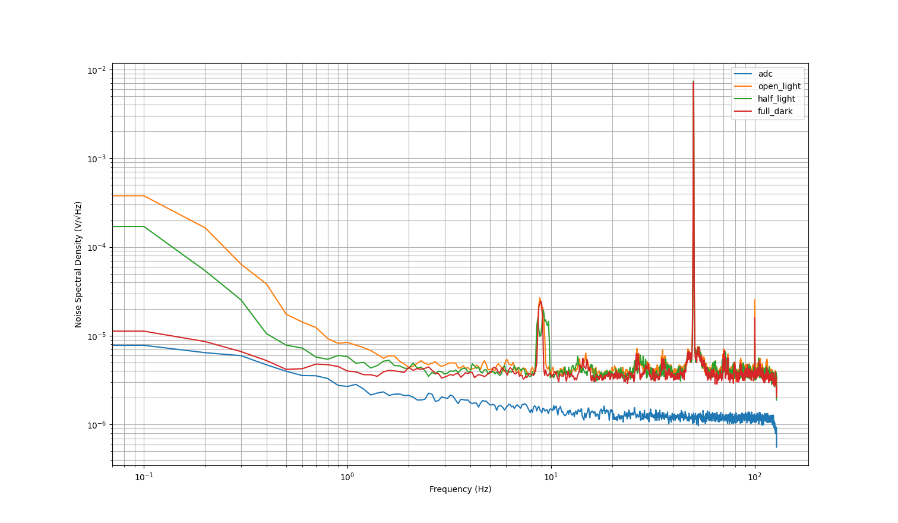

<h3 align="center">OSEM Noise Analysis</h3>

 documentation  

# noise.py 

Script to plot ASD of time series noise data.

OSEM Noise analysis for -
1. ADC noise
2. Open light noise
3. Half dark noise
4. Full dark noise

<h4><u>ADC Noise</h4></u>

Used a 50 ohm connector to close the port. Measured at 0 V.

<h4><u>Open Light Noise</h4></u>

This is the noise when the photodetector is completely uncovered. Measured at <b>-8.045 V</b>.  
Flag should not obstruct the path of light - all the LED light falls on the photodetector.

<h4><u>Half Light Noise</h4></u>

Flag is placed such that half of the photo detector is uncovered. This corresponds to a voltage output of half the maximum voltage. Measured at <b>-4.03 V</b>.

<h4><u>Full Dark Noise</h4></u>

Photodetector is completely covered. Measured at <b>-8.04 V</b>.

<h4><u>ASD Results</h4></u>

<h4><u>Discussions</h4></u>

1. <u>Peak at 50 Hz</u> -  

This is due to the 220 V AC line emitting 50 Hz radiation. It is called the <b>power line noise</b>.

2. <u>Peak at ~9-10 Hz</u> - This has two possibilities -  
    a. Mechanical Vibration - Possibility of a loose screw or other mechanical instabilities like table vibration.   
    b. Aliasing Noise - In this case, changing the sampling frequency would shift it.